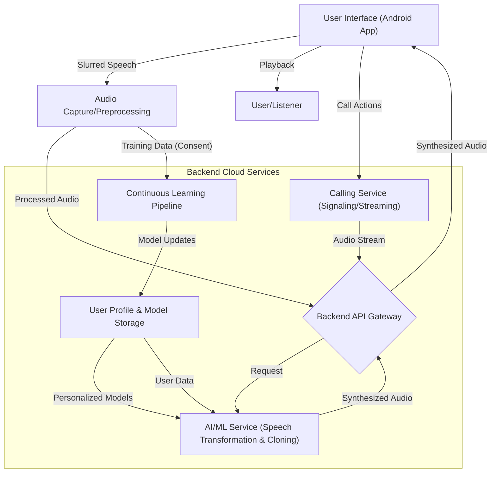

# VoiceAssist Design: Gemini 2.5 Pro (Exp)

Okay, here is a detailed design document proposal for the VoiceAssist application, based on the provided Product Requirements Document (PRD) \[cite: 1\].

## **VoiceAssist: Technical Design Document**

**1\. Introduction & Overview**

This document outlines the technical design for VoiceAssist, an application aimed at enabling users with slurred speech, particularly due to neurodegenerative conditions like Parkinson's, to communicate effectively in their own synthesized "healthy" voice \[cite: 4, 6\]. The initial focus (MVP) is on Android users in India, supporting Hindi, English, and Hinglish \[cite: 7, 47, 68\]. The core functionality includes real-time speech transformation, personalized voice cloning, in-app calling, and continuous adaptation to the user's evolving speech patterns \[cite: 4, 19, 41, 43, 56, 61\]. This design covers the architecture, technology stack, AI/ML models, app design, data management, and a phased rollout starting with a Proof of Concept (PoC).

**2\. Goals & Non-Goals**

**Goals:**

* Develop a system for real-time (or near-real-time) transformation of slurred speech into a personalized, healthy-sounding synthesized voice \[cite: 41, 56\].  
* Implement robust voice cloning using user-provided samples (current and historical) \[cite: 51, 58\].  
* Build an accessible and easy-to-use Android application for the MVP \[cite: 49, 65, 68\].  
* Support in-app one-on-one audio calls for the MVP \[cite: 17, 61\].  
* Enable continuous learning and adaptation of the voice models as the user's speech changes \[cite: 19, 43, 57\].  
* Support text-to-speech using the cloned voice \[cite: 18, 63\].  
* Ensure user privacy and data security \[cite: 78, 79, 81\].  
* Support Hindi, English, and Hinglish languages \[cite: 7, 47\].

**Non-Goals (for PoC/MVP):**

* iOS or web application support (planned post-MVP) \[cite: 69\].  
* Integration with third-party calling apps like WhatsApp or Zoom (planned post-MVP) \[cite: 20, 45, 72, 113\].  
* Video or group call support (planned post-MVP) \[cite: 4, 20\].  
* Offline processing (explore feasibility, likely cloud-first for MVP) \[cite: 74, 97\].  
* Advanced emotion detection in synthesized speech (potential future enhancement) \[cite: 89\].  
* Support for languages beyond Hindi, English, Hinglish initially.

**3\. High-Level Architecture**

A client-server architecture is proposed:

* **Client (Android App):** Captures user's slurred speech, handles user interface interactions (including in-app calls), plays back synthesized audio, and manages user settings. May perform lightweight pre-processing or potentially some on-device inference for latency-critical tasks if feasible \[cite: 74\].  
* **Backend (Cloud):** Hosts the core AI/ML models for speech transformation and voice cloning, manages user data and model personalization, handles signaling and audio streaming for in-app calls, and orchestrates the continuous learning pipeline.  
* **Continuous Learning Pipeline:** A separate or integrated component responsible for collecting (with consent) new speech data, retraining/fine-tuning user-specific models, and deploying updated models \[cite: 54, 76, 77, 136\].

Code snippet

**4\. Technology Stack Choices**

| Component | Technology Choice | Rationale & Alternatives Considered |
| :---- | :---- | :---- |
| **Frontend (MVP)** | Native Android (Kotlin/Java) | **Chosen:** Best performance, access to native APIs (audio, accessibility), aligns with MVP target platform \[cite: 68\]. **Alternatives:** React Native/Flutter (Cross-platform benefits, but potential native integration/performance overhead). |
| **Backend API** | Python (Flask/FastAPI) | **Chosen:** Strong AI/ML ecosystem integration (TensorFlow, PyTorch), rapid development. FastAPI preferred for async performance. **Alternatives:** Node.js (Good for I/O bound tasks, real-time), Go (Performance). |
| **AI/ML Framework** | PyTorch / TensorFlow | **Chosen:** Both are mature with extensive libraries, large communities, and support for mobile deployment (TF Lite, PyTorch Mobile). Choice depends on team expertise and specific model needs. |
| **Real-time Comms** | WebSockets (via Backend/Service) | **Chosen:** Standard for low-latency bi-directional communication needed for calls and real-time synthesis feedback. **Alternatives:** WebRTC (More complex, peer-to-peer focused, might be overkill for MVP in-app calls). |
| **Database** | PostgreSQL / MongoDB | **Chosen:** PostgreSQL for relational data (user profiles, settings). MongoDB for potentially unstructured data (model parameters, logs). Choice depends on final data structure. **Alternatives:** Other SQL/NoSQL databases. |
| **Cloud Provider** | AWS / GCP / Azure | **Chosen:** All offer managed services for compute (EC2/VMs, Kubernetes), storage (S3/Blob/Cloud Storage), databases, and AI/ML platforms. Choice depends on team familiarity, cost, and specific service needs (e.g., SageMaker, Vertex AI, Azure ML). |
| **Infrastructure** | Docker, Kubernetes (Optional) | **Chosen:** Containerization for consistency across environments, orchestration for scalability and management. **Alternatives:** Serverless (Lambda/Cloud Functions \- potentially for API endpoints, less so for stateful ML inference), direct VM deployment. |

**5\. AI/ML Model Design**

This is the core technical challenge. Multiple models will likely be needed:

* **a) Voice Cloning / Personalized TTS:**

  * **Goal:** Synthesize speech in the user's target "healthy" voice from text or intermediate representations.  
  * **Approach:** Use deep learning TTS models (e.g., Tacotron 2, FastSpeech 2, VITS) combined with speaker embedding or fine-tuning techniques.  
  * **Training Data:** Requires recordings of the user's "healthy" voice \[cite: 58\]. Crucially, the PRD mentions using *historical* data (old recordings, videos) \[cite: 51, 58, 84\], which poses a challenge (quality, noise, format). Pre-processing and data augmentation will be vital. Initial training might require 15-30 minutes of clean audio, but less could be feasible with transfer learning. Also needs samples of the *current* voice for adaptation \[cite: 58\].  
  * **Adaptation:** Fine-tune the base model with ongoing user interactions and potentially user feedback on output quality \[cite: 59\].  
* **b) Slurred Speech Recognition / Transformation:**

  * **Goal:** Convert the user's incoming slurred speech into either clean text or directly into audio features that the Voice Cloning model can use.  
  * **Approach Options:**  
    1. **Slurred STT \-\> Text \-\> Personalized TTS:** Use a Speech-to-Text model trained or fine-tuned specifically on the user's slurred speech patterns. Project Euphonia is relevant research here \[cite: 38\]. The output text then feeds the Voice Cloning model.  
       * *Pros:* Leverages existing STT/TTS pipelines. Easier to debug intermediate text.  
       * *Cons:* Error propagation (STT errors affect TTS). May lose nuances (prosody, emotion) if converting fully to text. Latency could be higher due to sequential steps.  
    2. **Direct Speech-to-Speech Transformation:** Train a model (e.g., sequence-to-sequence with attention, GANs) to directly map acoustic features of slurred speech to acoustic features of the target healthy speech.  
       * *Pros:* Potentially lower latency, might preserve more speech nuances.  
       * *Cons:* Requires parallel data (time-aligned slurred and healthy speech), which is very hard to obtain. Complex model architecture. Harder to debug. Might use slurred input \+ target text as a weaker supervision signal.  
  * **Chosen Approach (Initial):** Option 1 (Slurred STT \-\> Text \-\> Personalized TTS) seems more feasible for PoC/MVP due to data constraints and easier implementation leveraging existing tech. However, the STT model *must* be heavily personalized/adapted. Research into Option 2 should continue post-MVP.  
  * **Training Data:** Requires samples of the user's *slurred* speech, ideally paired with corresponding text transcriptions or (if possible) "healthy" equivalents. Continuous data collection during app usage is essential \[cite: 76, 77\].  
* **c) Continuous Learning:**

  * **Goal:** Adapt both STT and TTS models over time as the user's speech degrades \[cite: 19, 43, 57, 114\].  
  * **Approach:** Implement a pipeline to periodically collect new speech samples (with consent) \[cite: 76\], re-train or fine-tune the user's personalized models on the backend \[cite: 77\], evaluate performance, and deploy updated models to the user profile \[cite: 94\]. This could be automated or triggered manually/periodically. User feedback on synthesized quality can be incorporated \[cite: 90, 93\].  
* **d) Deployment (Edge vs. Cloud):**

  * **PoC/MVP:** Primarily cloud-based deployment for the heavy AI/ML models due to complexity and resource requirements \[cite: 74\]. Focus on optimizing API calls and streaming for minimal perceived latency.  
  * **Post-MVP:** Explore on-device inference (using TF Lite, PyTorch Mobile, ONNX Runtime) for parts of the pipeline (e.g., potentially STT or simpler TTS) on capable devices to reduce latency and improve offline usability \[cite: 74, 97\]. This requires model quantization and optimization.

**6\. App Design (UI/UX & Accessibility)**

* **Platform:** Android Native (MVP) \[cite: 68\].  
* **Core Navigation:** Simple, task-oriented: Large buttons/targets for "Live Speech," "Start Call," "Text-to-Speech," "Settings" \[cite: 65, 85\]. Minimize screen transitions.  
* **Accessibility:** Crucial for target users with potential motor/cognitive challenges \[cite: 8, 49\].  
  * Large fonts, high contrast themes, adjustable text size \[cite: 86\].  
  * Compatibility with Android accessibility services (TalkBack, Switch Access).  
  * Consider voice commands or simplified tap gestures for navigation \[cite: 67\].  
* **Onboarding:** Guided wizard for initial setup, permissions \[cite: 81\], and voice sample collection (current voice, optional historical audio upload) \[cite: 58, 83, 84\]. Clear explanations and progress indicators.  
* **In-Call UI:** Clear indication of connection status, mic mute, speaker/earpiece toggle, end call. Display synthesized speech transcription for user confirmation (optional).  
* **Text-to-Speech:** Simple text input area, support for importing text/documents \[cite: 63\], list of saved quick phrases \[cite: 64\].  
* **Settings:** Allow tweaking voice parameters (speed, pitch \- if feasible) \[cite: 60, 88\], manage stored data, language selection (UI: English/Hindi) \[cite: 66, 87\].  
* **Language:** UI localization for English and Hindi \[cite: 66, 87\]. Model support for English, Hindi, Hinglish \[cite: 7\].

**7\. Data Management & Privacy**

* **Data Storage:**  
  * User profiles, settings, encrypted credentials.  
  * Raw voice samples (slurred, healthy, historical) \- stored securely, encrypted at rest and in transit \[cite: 78\].  
  * Personalized model parameters \- stored securely, linked to the user.  
* **Privacy:**  
  * **Consent:** Explicit user consent required for microphone access, data storage, and use of voice data for model training/improvement \[cite: 81, 125\]. Clear, easy-to-understand privacy policy.  
  * **Anonymization:** Explore anonymization/de-identification for aggregated data used for general model improvements, but personalization inherently requires linking data to the user.  
  * **Data Access:** Strict access controls. User data should only be processed for the service's purpose \[cite: 79\].  
* **Security:**  
  * Standard security practices: HTTPS, secure authentication (potentially device-based checks or biometrics to prevent misuse \[cite: 82, 128\]), input validation, dependency scanning.  
  * Protect against unauthorized access to voice models and user data \[cite: 127\].  
* **Compliance:** Design with Indian data protection laws in mind. Plan for potential future compliance needs like HIPAA if expanding to clinical settings in the US \[cite: 80, 129\].

**8\. Infrastructure & Scalability**

* **Cloud Deployment:** Use a major cloud provider (AWS/GCP/Azure).  
* **Compute:** Mix of VM instances or Kubernetes pods for API, AI/ML inference, and call handling. GPU instances needed for training and potentially for low-latency inference.  
* **Storage:** Object storage (S3/GCS/Blob) for voice samples and model artifacts. Database for user metadata.  
* **Scalability:** Design backend services to be stateless where possible. Use load balancers and auto-scaling groups/deployments to handle varying user load, especially during concurrent calls \[cite: 75\].  
* **Monitoring:** Implement logging, monitoring, and alerting for system health, performance (latency, error rates), and resource utilization.  
* **Low Bandwidth:** Optimize data transfer; use efficient audio codecs (e.g., Opus). Consider strategies for graceful degradation if network conditions are poor \[cite: 73\].

**9\. Proof of Concept (PoC) Plan (3-4 Weeks) \[cite: 102\]**

* **Goal:** Validate the feasibility of the core real-time speech-to-personalized-speech pipeline with acceptable latency \[cite: 102, 103\].  
* **Scope:**  
  * Minimal Android app UI: Button to start/stop recording, display basic output. No calling feature \[cite: 105\].  
  * Backend service: Implement simplified versions of the Slurred STT (or basic recognition) and Personalized TTS models. Focus on the *connection* between them.  
  * Basic Voice Cloning: Train on a very small set of "healthy" samples (Wizard-of-Oz or pre-recorded) \[cite: 104\].  
  * Basic Slurred Input Handling: Use pre-recorded slurred samples or live input from 1-2 test users.  
  * Deployment: Simple cloud deployment (e.g., single VM).  
* **Technology:** Use chosen stack components (Python backend, TF/PyTorch).  
* **Success Criteria:** Demonstrate end-to-end flow: user speaks slurred input \-\> app sends to backend \-\> backend processes \-\> app receives synthesized audio \-\> playback within \~1-2 seconds (initial target, refine based on results) \[cite: 106\]. Subjective quality assessment by team/pilot user \[cite: 106\].

**10\. MVP Plan (8-10 Weeks Post-PoC) \[cite: 107\]**

* **Goal:** Launch functional Android app for Indian users with core features \[cite: 107, 111\].  
* **Scope (Based on PoC validation):**  
  * Full Android App UI: Implement accessible design, onboarding, text-to-speech \[cite: 109\], settings.  
  * Robust AI/ML Models: Improve accuracy and reduce latency of STT/TTS models based on PoC learnings. Implement user-specific training/adaptation pipeline (basic version) \[cite: 109\]. Handle Hindi/English/Hinglish.  
  * In-App Calling: Implement one-on-one audio calls using WebSockets/backend service \[cite: 108\].  
  * Backend Infrastructure: Set up scalable cloud infrastructure, database, user management, basic analytics \[cite: 111\].  
  * Onboarding & Data Collection: Implement voice sample collection (current \+ historical) \[cite: 110\].  
  * Testing: Rigorous testing with pilot users \[cite: 111\].

**11\. Future Considerations (Phase 2+) \[cite: 112\]**

* iOS Application \[cite: 69, 115\].  
* Web/Desktop Interface \[cite: 68\].  
* Third-Party Integrations (WhatsApp, Zoom, Native Dialer) \[cite: 72, 113\].  
* Improved Continuous Learning (more sophisticated adaptation) \[cite: 114\].  
* On-Device Processing Exploration \[cite: 74, 97\].  
* Advanced Features (Emotion, group calls, video) \[cite: 4, 20, 89\].  
* Wider Language Support.  
* Clinical/Healthcare Partnerships \[cite: 116\].

**12\. Risks & Mitigation (Technical Focus)**

* **High Latency:** Mitigation: Optimize models (quantization, efficient architectures), explore edge processing, efficient networking, asynchronous processing \[cite: 124\]. Manage user expectations, especially in PoC/MVP \[cite: 62\].  
* **Model Accuracy (STT & TTS):** Mitigation: Focus on high-quality, personalized training data. Implement robust continuous learning pipeline \[cite: 125, 126\]. Allow user feedback loop for correction. Start with constrained vocabulary if needed.  
* **Data Scarcity (Healthy Voice):** Mitigation: Leverage historical data creatively \[cite: 51\]. Explore transfer learning from larger voice datasets. Set realistic expectations if minimal healthy data exists.  
* **Scalability:** Mitigation: Design stateless services, use managed cloud services, load testing.  
* **Continuous Learning Complexity:** Mitigation: Start simple (e.g., periodic batch retraining). Build robust data pipeline and monitoring \[cite: 126, 136\].  
* **Security/Privacy Breach:** Mitigation: Follow best practices (encryption, access control), conduct security reviews, clear consent mechanisms \[cite: 127, 128\].

This design provides a roadmap for building VoiceAssist, balancing the ambitious vision with a phased approach starting with validating the core technology in the PoC. Continuous iteration and user feedback will be crucial throughout development.

